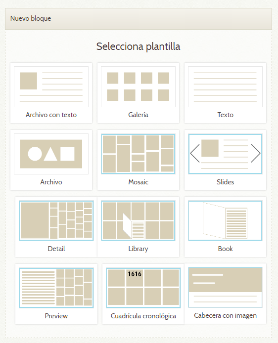

# Expobus
[Software developed at the Library of the University of Seville to extend the open source web application Omeka](README.md#english)

[Software desarrollado en la Biblioteca de la Universidad de Sevilla para ampliar la aplicación de código abierto Omeka](README.md#español)

## English
### Developments
#### Introduction
The Library of the University of Seville has developed a set of solutions to extend the functionalities of the open source application [Omeka](http://omeka.org) [(more information)](README.md#about-omeka), with the purpose of adapt it to its needs. To achieve it, themes and plugins have been developed.

Regarding plugins, one called *Mosaic* has been developed to extend Exhibit Builder, so that more block layouts are available. In addition, a plugin has been created to add support for Google Analytics.

Concerning style, two very customizable themes have been developed: *Arguijo* and *Códices*. These themes ar very versatile: they offer many options that can be selected individually for each exhibition, in such a way that two exhibitions using the same theme could have very different looks. The most interesting point in this is the diversity that can be achieved without advanced computer knowledge.

#### [Mosaic Plugin](Mosaic)
This plugin extends the Exhibit Builder plugin, increasing the number of block layouts available for exhibition pages, originally three. Each new layout features a different way of showing items in exhibitions. In addition, each has different options to customize the block appearance.



#### [Analytics Plugin](Analytics)
It's a simple plugin that adds support for Google Analytics to Omeka. The statistics and reports availables thanks to this tool have a great value when assessing the impact of the exhibitions. Moreover, knowing how users reach the website and their behaviour help for continual improvement.

#### [Arguijo Theme](arguijo)
This theme was first used on an exhibition about [Juan de Arguijo](https://en.wikipedia.org/wiki/Juan_de_Arguijo). Thanks to its customization options, very diverse exhibitions can be created. [Example](http://expobus.us.es/omeka/exhibits/show/cervantes).

#### [Códices Theme](codices)
This theme is designed not only to give an appearance to exhibitions, but to the whole Omeka site. It features a vertical and carefully designed layout that gives importance to pictures while accepting great quiantities of text. [Example](http://expobus.us.es/omeka/exhibits/show/codices-miniados).

#### [Herramienta de importación desde Europeana XML](europeana-xml-import)
This tool, programmed in VB .NET, is able to read metadata in Europeana format XML files from other websites, generating a CSV for Omeka. This way, creating an exhibition can be even faster, since, if the items arealready available, their metadata and images can be used. The new OAI-PMH plugins available for Omeka can also be used.

### Documentation
The original Omeka documentation can be consulted at the [project website](http://omeka.org/codex/Documentation). However, the Library has edited additional documentation (only available in Spanish yet). The documentation related to the developments described above is also attached.

#### Omeka about documentation
(In edition process)
#### Documentation about own developments
(In edition process)

### About Omeka
#### What is Omeka and its advantages
Omeka is a free open source web application for digital publishing of contents and oriented to researchers, librarians, archivists and curators. It allows for publicly releasing archives, collections and exhibitions. It's a project by the [Roy Rosenzweig Center for History and New Media](http://chnm.gmu.edu/), at the [George Mason University](http://www.gmu.edu/). From here, we thank them for the development of this project, so useful for libraries and museums.

It's very easy to use: Omeka is designed with people without specialization in computers in mind, allowing users to focus on the content. In addition, Omeka has a community that contributes documentation and developments to extend it.

Omeka is extendible, scalable and flexible: it's able to handle very large collections of metadata and files. It can store any kind of file and metadata can be extended beyond Dublin Core, the default set. These items can be reused in different parts of the website. Its capabilities can be extended with plugins, either using existing ones or developing custom ones. The appearance of Omeka can also be customized by the use of themes, either by the community or custom ones.

The metadata of items added to Omeka can be easily exported and they can be collected by OAI-PMH. In addition, items can be imported to Omeka in an easier way by using plugins, for example from CSV files, Dropbox or OAI-PMH repositories. Omeka also features a search engine.

#### Plugin Exhibit Builder
It's a plugin developed by the creators of Omeka. It's used to create virtual exhibitions using items available in the application. Each exhibition can use a different theme and the theme options can be configured individually. The items are shown in blocks, which are in turn combined forming pages. Pages can be sorted hierarchically.

Although it's true that the capabilities of this plugin are quite powerful, the final result will be limited by the applied theme and the layout blocks used. Default layouts are very scarce, so the Library of the University of Seville has developed a solution to extend the extant functionality and decrease the restrictions that might come up when creating exhibitions. Neertheless, the original Omeka philosophy of simplicity and easiness has been kept.

### Installation guide
With illustrative purposes, described below are the steps needed to have an Omeka installation for its use by any person or institution. The following information is not official and its intended only as a guide. The original documentation should be consulted at the [Omeka website](http://omeka.org/codex/Documentation).

#### Requirements
Omeka is a PHP web application that requires a server with:
- HTTP server, like Apache. The mod_rewrite module is needed.
- PHP interpreter at version 5.3.2 or higher.
- MySQL database server 5.0 or higher.
- ImageMagick, for resizing images.
Requirements can be checked [here](http://omeka.org/codex/Preparing_to_Install) prior to installation. If you don't have a server available, you can create a website at [omeka.net](http://omeka.net), which offers different plans, being the basic one free.

#### Installation of Omeka
The official steps for the installation on a machine with LAMP stack can be consulted [here](http://omeka.org/codex/Installation).

Nevertheless, an orientative sample summary is attached here with the steps to install Omeka. The commands are for a server with RHEL or CentOS 7, but they are comparable to those in other systems. Please use them with responsibility and run them with prudently. They are provided without warranty and as a mere guide.

```
# From a minimal CentOS 7 installation.

PACKAGE INSTALLATION
1. yum -y install httpd
2. yum -y install mariadb-server mariadb
3. yum -y install php php-mysql
 
SSH
1. yum -y install openssh-server
2. service sshd start
 
BOOT
1. Add firewall rule
	# firewall-cmd --permanent --add-service=http
	# firewall-cmd --reload
2. service httpd start
3. service mariadb start
 
 
DATABASE
1. mysql_secure_installation
2. mysql -u root -p
3. > use mysql
4. > insert into user(host, user, password) values('localhost','omeka',password('omeka'));
5. > insert into db(host,db,user,Select_priv, Insert_priv, Update_priv, Delete_priv, Create_priv, Drop_priv) values ('localhost','omeka_db','omeka','Y','Y','Y','Y','Y','Y');
6. > quit
7. mysqladmin -u root -p create omeka_db
8. mysqladmin -u root -p reload
9. mysql -u root -p
10. > ALTER DATABASE omeka_db DEFAULT CHARACTER SET 'utf8' DEFAULT COLLATE 'utf8_unicode_ci';
11. > quit
 
OMEKA INSTALLATION
1. curl -O http://omeka.org/files/omeka-2.5.zip
2. yum install unzip
3. unzip omeka-2.5.zip
4. rm omeka-2.5.zip
5. mv omeka-2.5/ /var/www/
6. cd /var/www/
7. mv omeka-2.5/ omeka
8. cd omeka
9. chown omeka . -R
10. chmod +x *.php -R
11. chmod u+w files -R
12. chgrp apache /var/www/omeka -R
!!! DISABLE SELinux en /etc/selinux/config
13. setenforce 0
14. Modify db.ini
15. Install ImageMagick: yum install ImageMagick
16. Change language if needed at application/config
17. Open in a web browser and finish installation
18. rm /var/www/omeka/install
 
 
AUTOMATIC INIT AT BOOT
1. chkconfig httpd on
2. chkconfig mariadb on
```

#### Installation of the developments in this repository
The developments by the Library are plugins and themes. Their installation is very simple: just login to the server with a FTP client or similar an upload the files to the proper directories. Alternatively, the files can be download directly to the server from the command line. Plugins must be located inside the *plugins* folder of the Omeka directory, each of them in its own folder. Similarly, themes must be placed into the *themes* folder.

Once in these directories, plugins must be installed and enabled from the plugins menu in Omeka, at the admin section. Likewise, themes can be enabled at the appearance tab.

### License
The code in this repository is under the [Apache 2.0 license](https://www.apache.org/licenses/LICENSE-2.0), except for third-party software included, which might have their own license terms. Any graphical contents related to Expobus such as logos are property of the Library of the University of Seville and **are not licensed under any public use or distribution license**. All rights are reserved for this graphics, © Biblioteca de la Universidad de Sevilla, 2017.


## Español
### Desarrollos
#### Introducción
La Biblioteca de la Universidad de Sevilla ha desarrollado un conjunto de soluciones para ampliar las funcionalidades de la aplicación de software libre [Omeka](http://omeka.org) [(más información)](README.md#sobre-omeka), con idea de adaptarla a sus necesidades. Para ello, se han desarrollado temas y plugins.

Respecto a los plugins, se ha desarrollado uno llamado *Mosaico* para extender Exhibit Builder, de forma que haya más diseños de bloque disponibles. También se ha creado uno para añadir soporte para Google Analytics.

En cuanto al estilo, se han desarrollado dos temas muy personalizables: Arguijo Y Códices. Estos temas son muy versátiles: disponen de muchas opciones que se pueden elegir individualmente para cada exposición, de forma que dos exposiciones que usan el mismo tema pueden tener un aspecto muy distinto. Lo más interesante de esto es la diversidad que se puede conseguir sin necesidad de conocimientos informáticos.

#### [Plugin Mosaic](Mosaic)
Este plugin amplía el plugin Exhibit Builder aumentando el número de diseños de bloque disponibles para las páginas de exposición, originalmente tres. Cada nuevo diseño aporta una forma distinta de introducir elementos en las exposiciones. Además, cada uno tiene distintas opciones para personalizar la apariencia.


#### [Plugin Analytics](Analytics)
Es un sencillo plugin que añade a Omeka soporte para Google Analytics. Las estadísticas e informes disponibles con esta herramienta tienen un gran valor a la hora de valorar el impacto de las exposiciones. Además, conocer cómo los usuarios llegan al sitio web y su comportamiento sirve para mejorar continuamente.

#### [Tema Arguijo](arguijo)
Este tema se estrenó con la exposición sobre [Juan de Arguijo](https://es.wikipedia.org/wiki/Juan_de_Arguijo). Gracias a sus opciones de personalización, se pueden crear exposiciones muy diversas. [Ejemplo](http://expobus.us.es/omeka/exhibits/show/cervantes).

#### [Tema Códices](codices)
Este tema está pensado para no sólo dar una apariencia a las exposiciones, sino que puede dar estilo a todo el sitio de Omeka. Presenta un diseño vertical y cuidado que da importancia a las imágenes al mismo tiempo que acepta grandes cantidades de texto. [Ejemplo](http://expobus.us.es/omeka/exhibits/show/codices-miniados).

#### [Herramienta de importación desde Europeana XML](europeana-xml-import)
Esta herramienta programada en VB .NET es capaz de leer los metadatos de los descriptores XML en formato Europeana de otros sitios web y generar un CSV para Omeka. De esta forma, se agiliza aún más el proceso de creación de una exposición, ya que si los elementos están ya disponibles, se podrán aprovechar sus metadatos e imagen de portada. También se pueden usar los nuevos plugins de OAI-PMH de Omeka.

### Documentación
La documentación original de Omeka puede consultarse en la [web del proyecto](http://omeka.org/codex/Documentation). Sin embargo, la Biblioteca ha redactado documentación adicional en español. También se adjunta la documentación asociada a los desarrollos mencionados arriba.
#### Documentación sobre Omeka
(En proceso de edición)
#### Documentación sobre los desarrollos propios
(En proceso de edición)

### Sobre Omeka
#### Qué es Omeka y sus ventajas
Omeka es una aplicación web gratuita y de código abierto para la publicación digital de contenidos orientada a investigadores, bibliotecarios, archiveros y museólogos. Permite poner a disposición del público archivos, colecciones y exposiciones. Es un proyecto del [Roy Rosenzweig Center for History and New Media](http://chnm.gmu.edu/), de la [Universidad George Mason](http://www.gmu.edu/). Desde aquí les agradecemos el desarrollo de este proyecto, tan útil para las instituciones bibliotecarias y museísticas.

Es muy fácil de usar: está diseñado pensando en personal sin especialización en informática, permitiendo a los usuarios centrarse en el contenido. Además, Omeka dispone de una comunidad que aporta documentación y desarrollos para ampliarlo.

Omeka es extensible, escalable y flexible: es capaz de manejar colecciones muy grandes de metadatos y archivos. Puede almacenar cualquier tipo de archivo, y los metadatos se pueden extender más allá del Dublin Core, conjunto por defecto. Estos elementos se pueden reutilizar en distintas partes del sitio web. Se pueden ampliar sus capacidades mediante el uso de los plugins, ya sea utilizando los existentes o desarrollando plugins propios. También se puede personalizar la apariencia de Omeka mediante el uso de temas existentes o propios.

Los metadatos de elementos añadidos a Omeka se pueden exportar fácilmente y se pueden recolectar mediante OAI-PMH. Además, se pueden importar elementos a Omeka de forma más sencilla mediante el uso de plugins, como por ejemplo desde archivos CSV, Dropbox o repositorios OAI-PMH. Omeka también dispone de un buscador.

#### Plugin Exhibit Builder
Es un plugin desarrollado por los creadores de Omeka. Se utiliza para crear exposiciones virtuales usando los elementos existentes en la aplicación. Cada exposición puede usar un tema distinto y se pueden configurar sus opciones individualmente. Los elementos se muestran en bloques, que a su vez se combinan formando páginas. Las páginas se pueden ordenar jerárquicamente.

Si bien las capacidades de este plugin son bastante potentes, el resultado final estará limitado al tema que se aplique y los bloques que se utilicen. Los diseños disponibles por defecto para estos bloques son muy escasos, por lo que la Biblioteca de la Universidad de Sevilla ha desarrollado una solución para ampliar la funcionalidad existente y reducir las restricciones que pudieran surgir al crear exposiciones. Sin embargo, se ha mantenido la filosofía de sencillez y facilidad de uso de Omeka.

### Guía de instalación
Con propósitos ilustrativos, se detallan a continuación los pasos necesarios para tener una instalación de Omeka para su uso por cualquier persona o institución. La siguiente información no es oficial y se pretende que sirva como guía. La documentación original debe consultarse en la [web de Omeka](http://omeka.org/codex/Documentation).

#### Requisitos
Omeka es una aplicación web en PHP que requiere un servidor con:
- Servidor HTTP, como Apache. Necesita el módulo mod_rewrite.
- Intérprete PHP con la versión 5.3.2 o superior.
- Servidor de bases de datos MySQL 5.0 o superior.
- ImageMagick, para redimensionar imágenes.
Se pueden consultar los requisitos previos a la instalación [aquí](http://omeka.org/codex/Preparing_to_Install). Si no se dispone de un servidor, se puede crear un sitio en [omeka.net](http://omeka.net), que ofrece distintos planes, siendo el básico gratuito.

#### Instalación de Omeka
Los pasos oficiales para la instalación sobre una máquina con pila LAMP se pueden consultar [aquí](http://omeka.org/codex/Installation).

Sin embargo, adjuntamos aquí un resumen de ejemplo orientativo de los pasos necesarios para instalar Omeka. Los comandos son para un servidor con RHEL o CentOS 7, aunque son extrapolables a otros sistemas. Se ruega hacer un uso responsable y ejecutarlos con prudencia. No proporcionamos ninguna garantía y se incluye aquí como una mera guía.
```
# Partiendo de una imagen minimal de CentOS 7.

INSTALACIÓN DE PAQUETES
1. yum -y install httpd
2. yum -y install mariadb-server mariadb
3. yum -y install php php-mysql
 
SSH
1. yum -y install openssh-server
2. service sshd start
 
ARRANQUE
1. Añadir regla firewall
	# firewall-cmd --permanent --add-service=http
	# firewall-cmd --reload
2. service httpd start
3. service mariadb start
 
 
BASE DE DATOS
1. mysql_secure_installation
2. mysql -u root -p
3. > use mysql
4. > insert into user(host, user, password) values('localhost','omeka',password('omeka'));
5. > insert into db(host,db,user,Select_priv, Insert_priv, Update_priv, Delete_priv, Create_priv, Drop_priv) values ('localhost','omeka_db','omeka','Y','Y','Y','Y','Y','Y');
6. > quit
7. mysqladmin -u root -p create omeka_db
8. mysqladmin -u root -p reload
9. mysql -u root -p
10. > ALTER DATABASE omeka_db DEFAULT CHARACTER SET 'utf8' DEFAULT COLLATE 'utf8_unicode_ci';
11. > quit
 
INSTALACIÓN DE OMEKA
1. curl -O http://omeka.org/files/omeka-2.5.zip
2. yum install unzip
3. unzip omeka-2.5.zip
4. rm omeka-2.5.zip
5. mv omeka-2.5/ /var/www/
6. cd /var/www/
7. mv omeka-2.5/ omeka
8. cd omeka
9. chown omeka . -R
10. chmod +x *.php -R
11. chmod u+w files -R
12. chgrp apache /var/www/omeka -R
!!! DESACTIVAR SELinux en /etc/selinux/config
13. setenforce 0
14. Modificar db.ini
15. Instalar ImageMagick: yum install ImageMagick
16. Cambiar idioma en application/config
17. Abrir en navegador y completar instalación
18. rm /var/www/omeka/install
 
 
ARRANQUE AUTOMÁTICO
1. chkconfig httpd on
2. chkconfig mariadb on
```

#### Instalación de los desarrollos de este repositorio
Los desarrollos de la Biblioteca son plugins y temas. Su instalación es muy sencilla: tan sólo hay que acceder al servidor con un cliente FTP o similar y subir los archivos a las carpetas correspondientes. También se puede acceder al servidor por SSH y descargar los archivos desde la línea de comandos. Los plugins deben situarse en la carpeta *plugins* del directorio de instalación de Omeka, cada uno dentro de su propia carpeta. Similarmente, los temas deben copiarse en la carpeta *themes*.

Una vez se encuentren en estos directorios, los plugins deben instalarse y activarse en el menú de plugins de Omeka, en la sección de administración. Asimismo, los temas se pueden activar en la pestaña de apariencia.

### Licencia
El contenido de este repositorio está bajo la [licencia Apache 2.0](https://www.apache.org/licenses/LICENSE-2.0), excepto por el software the terceras partes incluido, que podría tener sus propios términos de licencia. Cualquier contenido gráfico relacioando con Expobus como logotipos son propiedad de la Biblioteca de la Universidad de Sevilla y **no están bajo licencia de uso o distribución públicos**. Todos los derechos reservados para estos gráficos, © Biblioteca de la Universidad de Sevilla, 2017.
